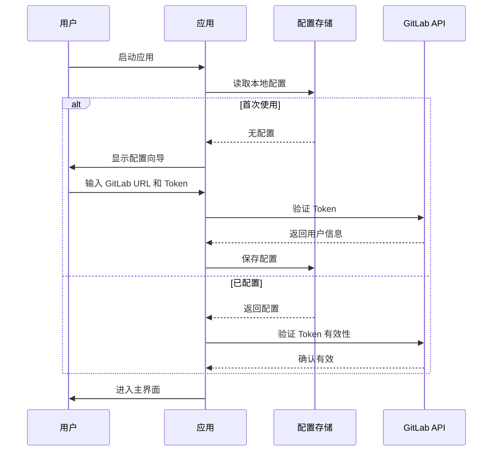
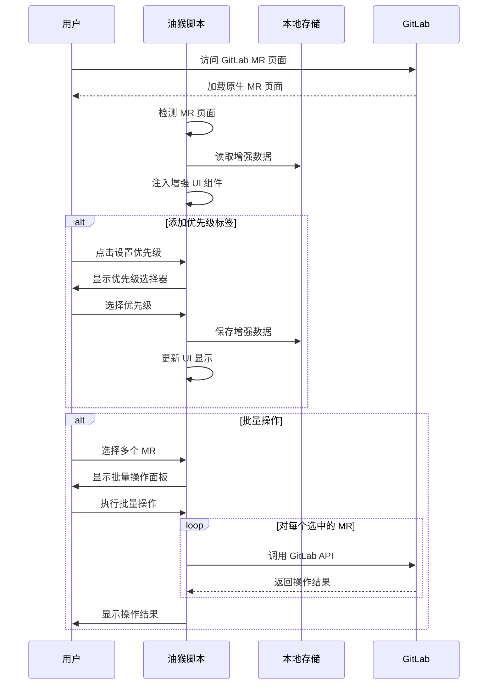
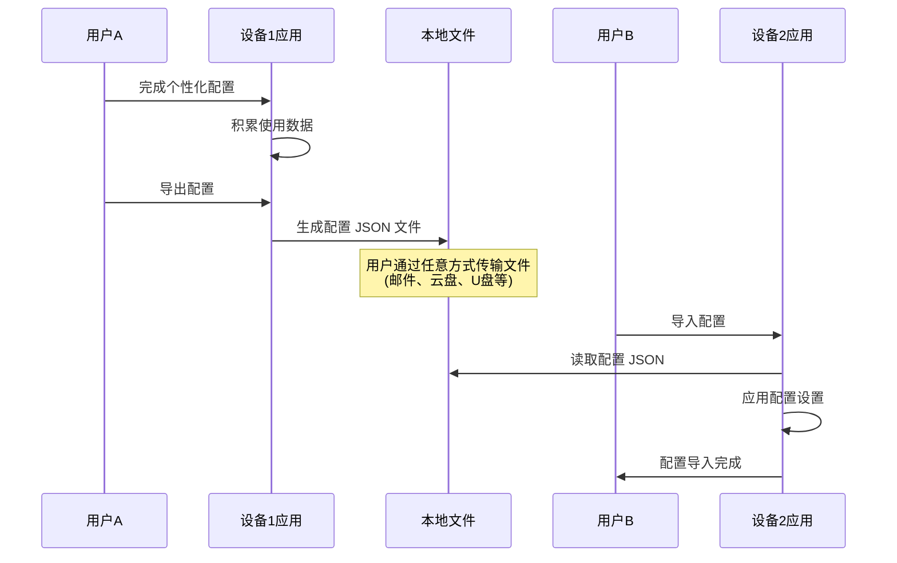
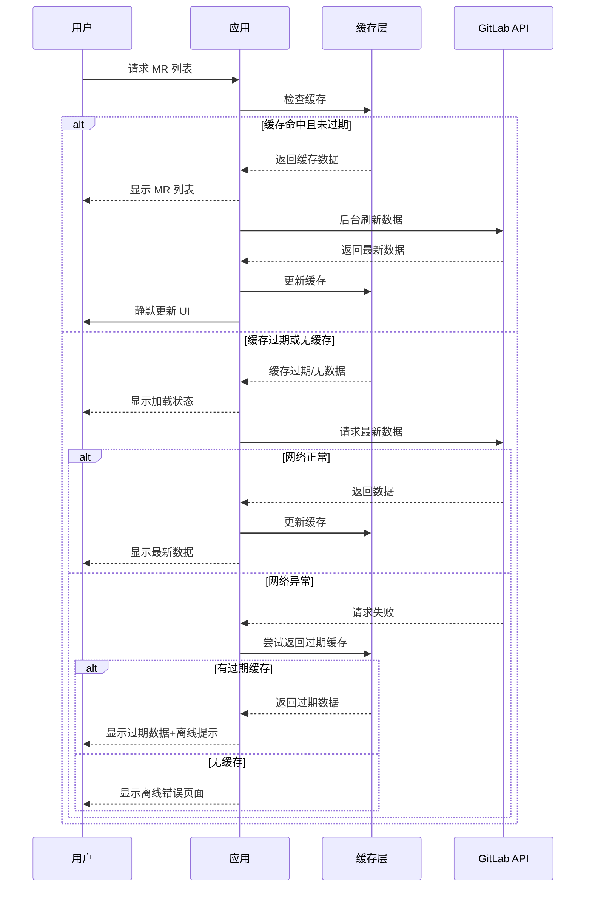
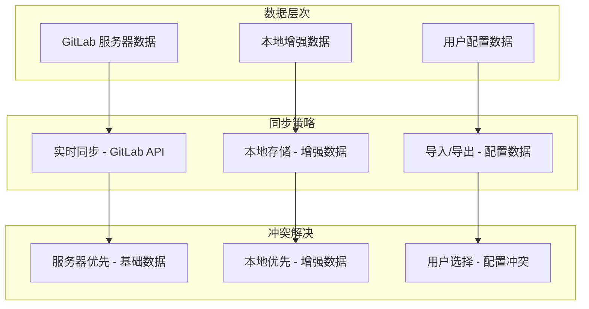

# GitLab 系列全栈架构文档

## 1. 引言

本文档概述了 GitLab 系列辅助工具套件的完整架构。该套件旨在通过**半自动化**方式优化企业 GitLab 工作流，在提高效率的同时保留用户的控制权。

**核心理念：**
- 🎯 **半自动化**：辅助而非替代，用户保持最终决策权
- 🚀 **渐进式采用**：从油猴脚本开始，按需扩展到其他端点
- 💾 **本地优先**：数据存储在本地，通过 JSON 导入/导出实现配置共享
- 🔧 **实用主义**：解决日常痛点，不过度设计

### 1.1 项目范围
- **第一阶段**：油猴脚本（Tampermonkey）- MR 增强功能
- **未来扩展**：浏览器扩展、VSCode 扩展、桌面应用

### 1.2 技术决策
- **Monorepo 架构**：使用 pnpm workspace 管理代码
- **共享包策略**：提取公共逻辑到 @coderdkai/gitlab-* 包
- **数据管理**：本地存储 + JSON 配置导入/导出

### 1.3 起始模板或现有项目
**状态：** 不适用 - 全新项目

这是一个使用 pnpm workspace 架构管理多个应用和共享包的新 monorepo 项目。

### 1.4 变更日志

| 日期 | 版本 | 描述 | 作者 |
|------|---------|-------------|--------|
| 2024-12-19 | v1.0 | 初始架构文档创建 | Winston（架构师）|

## 2. 高层架构

### 2.1 技术摘要

GitLab 系列采用**渐进式客户端架构**，通过 monorepo 管理多个独立但共享核心逻辑的客户端应用。首期聚焦油猴脚本实现快速价值交付，后续扩展到浏览器扩展、VSCode 扩展和桌面应用。所有端点共享 GitLab API 封装、缓存策略和工具函数，通过 pnpm workspace 实现代码复用。架构强调半自动化理念，在提升效率的同时保留用户控制权，采用本地存储策略配合 JSON 导入/导出实现配置共享。

### 2.2 平台和基础设施选择

**平台：** 纯客户端架构
**关键服务：** 无需云服务，所有逻辑在客户端执行
**部署方式：** 
- 油猴脚本：Greasy Fork 发布
- 浏览器扩展：Chrome/Edge Web Store
- VSCode 扩展：VS Code Marketplace
- 桌面应用：GitHub Releases

### 2.3 仓库结构

**结构：** Monorepo
**Monorepo 工具：** pnpm workspace
**包组织策略：** 
- `apps/*` - 各端应用
- `packages/*` - 共享包
- 每个包独立构建和版本管理

### 2.4 高层架构图

```mermaid
graph TB
    subgraph "用户入口"
        U1[GitLab 网页]
        U2[VSCode 编辑器]
        U3[桌面环境]
    end
    
    subgraph "应用层"
        A1[油猴脚本]
        A2[浏览器扩展]
        A3[VSCode 扩展]
        A4[桌面应用]
    end
    
    subgraph "共享包层"
        P1[@coderdkai/gitlab-api]
        P2[@coderdkai/gitlab-cache]
        P3[@coderdkai/gitlab-utils]
        P4[@coderdkai/gitlab-types]
        P5[@coderdkai/gitlab-components]
    end
    
    subgraph "外部系统"
        G[GitLab API]
        S[本地存储]
    end
    
    U1 --> A1
    U1 --> A2
    U2 --> A3
    U3 --> A4
    
    A1 --> P1
    A1 --> P2
    A1 --> P3
    A1 --> P4
    A1 --> P5
    
    A2 --> P1
    A2 --> P2
    A2 --> P3
    A2 --> P4
    A2 --> P5
    
    A3 --> P1
    A3 --> P3
    A3 --> P4
    
    A4 --> P1
    A4 --> P2
    A4 --> P3
    A4 --> P4
    A4 --> P5
    
    P1 --> G
    P2 --> S
    
    style A1 fill:#90EE90
    style P1 fill:#87CEEB
    style P2 fill:#87CEEB
    style P3 fill:#87CEEB
    style P4 fill:#87CEEB
    style P5 fill:#87CEEB
```

### 2.5 UI组件复用策略

为了在多端保持界面一致性并最大化代码复用，我们采用统一的UI组件包策略：

**@coderdkai/gitlab-components** 作为核心UI包，提供：

- **基础UI组件**：基于 `shadcn-vue` 的通用组件（Button、Input、Dialog等）
- **业务组件**：GitLab特定的组件（MRCard、UserAvatar、PriorityBadge等）  
- **Vue组合式函数**：跨端共享的逻辑（useMR、useFilter、useConfig等）
- **统一样式**：Tailwind CSS配置和全局样式

**各端适配策略**：
- **油猴脚本 + 浏览器扩展**：直接使用Vue组件，通过Shadow DOM隔离样式
- **桌面应用**：完整使用所有组件和样式
- **VSCode扩展**：仅使用组合式函数和工具类，UI采用VSCode原生组件

### 2.6 架构模式

- **Monorepo 模式：** 统一代码管理，便于共享和重构 - *理由：* 最大化代码复用，统一版本管理
- **分层架构：** 应用层、共享包层、外部接口层清晰分离 - *理由：* 关注点分离，便于维护和测试
- **适配器模式：** 统一的 GitLab API 适配器屏蔽版本差异 - *理由：* 应对不同 GitLab 版本的 API 差异
- **本地优先模式：** 数据存储在客户端，无需服务器 - *理由：* 保护隐私，降低运维成本
- **渐进增强模式：** 从简单功能开始，逐步添加高级特性 - *理由：* 快速交付价值，降低风险
- **插件化架构：** 每个端点独立但共享核心 - *理由：* 灵活部署，按需使用
- **组件复用架构：** 统一的UI组件包跨端共享 - *理由：* 保持界面一致性，减少重复开发

## 3. 技术栈

这是整个项目的**权威技术选择**。所有开发必须使用这些确切版本。

### 技术栈表

| 类别 | 技术 | 版本 | 用途 | 选择理由 |
|------|------|------|------|----------|
| 前端语言 | TypeScript | 5.3+ | 所有客户端开发 | 类型安全，更好的 IDE 支持 |
| 油猴框架 | Tampermonkey API | - | 油猴脚本开发 | 最广泛支持的用户脚本管理器 |
| 扩展框架 | Plasmo | 0.84+ | 浏览器扩展开发 | 现代化的扩展开发框架 |
| VSCode SDK | VS Code Extension API | 1.85+ | VSCode 扩展开发 | 官方 API |
| 桌面框架 | Tauri | 1.5+ | 桌面应用 | Rust 后端，性能好，包体小 |
| 前端框架 | Vue 3 | 3.4+ | 多端UI开发 | 熟悉度高，生态完善 |
| UI组件策略 | 共享组件包 | - | 跨端UI复用 | @coderdkai/gitlab-components 统一管理 |
| UI 组件库 | shadcn-vue | - | 共享UI组件基础 | 现代化UI组件库，基于Radix Vue和Tailwind CSS |
| 状态管理 | Pinia | 2.1+ | 桌面应用状态 | Vue 3 官方推荐 |
| 后端语言 | TypeScript | 5.3+ | Node.js 工具链 | 统一语言栈 |
| API 风格 | RESTful | - | GitLab API 调用 | GitLab 原生支持 |
| 数据库 | - | - | 不需要 | 纯客户端架构 |
| 缓存 | localStorage/IndexedDB | - | 浏览器端缓存 | 浏览器原生支持 |
| 文件存储 | 本地文件系统 | - | 配置导出 | 客户端本地存储 |
| 认证 | GitLab Token | - | API 认证 | Personal Access Token |
| 前端测试 | Vitest | 1.0+ | 单元测试 | 快速，与 Vite 集成好 |
| E2E 测试 | Playwright | 1.40+ | 端到端测试 | 支持多浏览器 |
| 构建工具 | Vite | 5.0+ | 应用构建 | 快速的开发体验 |
| 打包工具 | Rollup | 4.0+ | 库打包 | Vite 底层，适合库开发 |
| 包管理 | pnpm | 8.0+ | 依赖管理 | 节省磁盘，支持 workspace |
| CI/CD | GitHub Actions | - | 自动化构建 | 免费，与 GitHub 集成 |
| 代码规范 | ESLint + Prettier | 最新 | 代码质量 | 统一代码风格 |
| CSS 框架 | Tailwind CSS | 3.4+ | 原子化 CSS | 成熟的工具优先CSS框架，生态完善 |

## 4. 数据模型

### 4.1 核心数据类型

```typescript
// 基础 GitLab 实体
interface GitLabProject {
  id: number;
  name: string;
  path: string;
  web_url: string;
  namespace: {
    id: number;
    name: string;
    path: string;
  };
}

interface GitLabUser {
  id: number;
  username: string;
  name: string;
  avatar_url: string;
  web_url: string;
}

// MR（Merge Request）数据结构
interface MergeRequest {
  id: number;
  iid: number;
  title: string;
  description: string;
  state: 'opened' | 'closed' | 'merged';
  source_branch: string;
  target_branch: string;
  author: GitLabUser;
  assignees: GitLabUser[];
  reviewers: GitLabUser[];
  web_url: string;
  created_at: string;
  updated_at: string;
  merged_at?: string;
  // 扩展字段（我们的增强数据）
  enhancement?: {
    priority: 'low' | 'normal' | 'high' | 'urgent';
    tags: string[];
    notes: string;
    estimatedHours?: number;
  };
}

// 用户配置模型
interface UserConfig {
  // GitLab 连接配置
  gitlab: {
    baseUrl: string;
    accessToken: string;
    defaultProject?: string;
  };
  
  // UI 偏好设置
  preferences: {
    theme: 'light' | 'dark' | 'auto';
    language: 'zh-CN' | 'en-US';
    notifications: {
      enabled: boolean;
      types: ('mr_created' | 'mr_merged' | 'review_requested')[];
    };
  };
  
  // 工作流配置
  workflow: {
    autoAssignReviewer: boolean;
    defaultReviewers: string[];
    mrTemplate: string;
    branchNamingConvention: string;
  };
}

// 缓存数据结构
interface CacheEntry<T> {
  data: T;
  timestamp: number;
  expiry: number;
  key: string;
}

interface CacheStore {
  projects: CacheEntry<GitLabProject[]>;
  users: CacheEntry<GitLabUser[]>;
  mergeRequests: Record<string, CacheEntry<MergeRequest[]>>;
}
```

### 4.2 状态管理模型

```typescript
// Pinia Store 状态定义
interface AppState {
  // 认证状态
  auth: {
    isAuthenticated: boolean;
    user: GitLabUser | null;
    token: string | null;
  };
  
  // 当前选中的项目
  currentProject: GitLabProject | null;
  
  // MR 列表和过滤状态
  mergeRequests: {
    list: MergeRequest[];
    loading: boolean;
    error: string | null;
    filters: {
      state: string[];
      assignee: string[];
      reviewer: string[];
      label: string[];
    };
  };
  
  // 用户设置
  config: UserConfig;
}
```

## 5. API 规范（待完善）

_此部分将定义 GitLab API 的封装接口_

## 6. 组件设计（待完善）

_此部分将详细说明各个组件的职责和接口_

## 7. 外部 API（待完善）

_此部分将记录使用的 GitLab API 端点_

## 8. 核心工作流

### 8.1 用户认证流程



### 8.2 MR 增强工作流



### 8.3 配置同步工作流



### 8.4 离线优先工作流



### 8.5 跨端数据一致性



## 9. 项目结构

### 9.1 Monorepo 目录结构

```
gitlab-series/
├── README.md
├── package.json                    # 根包管理
├── pnpm-workspace.yaml            # pnpm workspace 配置
├── tsconfig.json                   # 根 TypeScript 配置
├── .eslintrc.js                    # ESLint 配置
├── .prettierrc                     # Prettier 配置
├── .github/
│   └── workflows/                  # GitHub Actions CI/CD
│       ├── build.yml
│       ├── test.yml
│       └── release.yml
├── docs/                           # 项目文档
│   ├── architecture.md
│   ├── development.md
│   └── deployment.md
│
├── apps/                           # 各端应用
│   ├── tampermonkey/              # 油猴脚本
│   │   ├── package.json
│   │   ├── vite.config.ts
│   │   ├── src/
│   │   │   ├── main.ts           # 入口文件
│   │   │   ├── components/       # Vue 组件
│   │   │   ├── stores/           # Pinia 状态管理
│   │   │   └── styles/           # Tailwind CSS 样式
│   │   └── dist/                 # 构建输出
│   │
│   ├── browser-extension/         # 浏览器扩展
│   │   ├── package.json
│   │   ├── plasmo.config.ts
│   │   ├── src/
│   │   │   ├── popup/           # 弹出窗口
│   │   │   ├── content/         # 内容脚本
│   │   │   ├── background/      # 后台脚本
│   │   │   └── options/         # 选项页面
│   │   └── build/               # 构建输出
│   │
│   ├── vscode-extension/         # VSCode 扩展
│   │   ├── package.json
│   │   ├── src/
│   │   │   ├── extension.ts     # 扩展入口
│   │   │   ├── commands/        # 命令处理
│   │   │   └── providers/       # 各种提供者
│   │   └── out/                 # 编译输出
│   │
│   └── desktop/                  # 桌面应用 (Tauri + Vue)
│       ├── package.json
│       ├── vite.config.ts
│       ├── src-tauri/           # Rust 后端
│       │   ├── Cargo.toml
│       │   ├── src/
│       │   │   └── main.rs
│       │   └── tauri.conf.json
│       ├── src/                 # Vue 前端
│       │   ├── main.ts
│       │   ├── App.vue
│       │   ├── components/      # shadcn-vue 组件
│       │   ├── stores/          # Pinia 状态管理
│       │   ├── views/           # 页面组件
│       │   └── assets/          # 静态资源
│       └── dist/                # 构建输出
│
├── packages/                      # 共享包
│   ├── types/                    # @coderdkai/gitlab-types
│   │   ├── package.json
│   │   ├── src/
│   │   │   ├── index.ts
│   │   │   ├── api.ts           # API 响应类型
│   │   │   ├── config.ts        # 配置类型
│   │   │   └── models.ts        # 数据模型
│   │   └── dist/
│   │
│   ├── components/               # @coderdkai/gitlab-components
│   │   ├── package.json
│   │   ├── src/
│   │   │   ├── index.ts         # 组件导出
│   │   │   ├── ui/              # 基础UI组件（基于shadcn-vue）
│   │   │   │   ├── Button/
│   │   │   │   ├── Input/
│   │   │   │   ├── Select/
│   │   │   │   ├── Dialog/
│   │   │   │   └── Badge/
│   │   │   ├── business/        # 业务组件
│   │   │   │   ├── MRCard/
│   │   │   │   ├── UserAvatar/
│   │   │   │   ├── PriorityBadge/
│   │   │   │   ├── StatusIndicator/
│   │   │   │   └── FilterPanel/
│   │   │   ├── composables/     # Vue 组合式函数
│   │   │   │   ├── useMR.ts
│   │   │   │   ├── useFilter.ts
│   │   │   │   └── useConfig.ts
│   │   │   └── styles/          # 共享样式
│   │   │       ├── globals.css
│   │   │       └── components.css
│   │   ├── tailwind.config.js   # Tailwind 配置
│   │   └── dist/
│   │
│   ├── api/                      # @coderdkai/gitlab-api
│   │   ├── package.json
│   │   ├── src/
│   │   │   ├── index.ts
│   │   │   ├── client.ts        # API 客户端
│   │   │   ├── endpoints/       # API 端点封装
│   │   │   │   ├── projects.ts
│   │   │   │   ├── merge-requests.ts
│   │   │   │   └── users.ts
│   │   │   └── auth.ts          # 认证处理
│   │   └── dist/
│   │
│   ├── cache/                    # @coderdkai/gitlab-cache
│   │   ├── package.json
│   │   ├── src/
│   │   │   ├── index.ts
│   │   │   ├── memory-cache.ts   # 内存缓存
│   │   │   ├── local-storage.ts  # 本地存储缓存
│   │   │   └── indexed-db.ts     # IndexedDB 缓存
│   │   └── dist/
│   │
│   └── utils/                    # @coderdkai/gitlab-utils
│       ├── package.json
│       ├── src/
│       │   ├── index.ts
│       │   ├── date.ts          # 日期工具
│       │   ├── validation.ts    # 验证工具
│       │   ├── formatting.ts    # 格式化工具
│       │   └── constants.ts     # 常量定义
│       └── dist/
│
├── tools/                        # 开发工具
│   ├── build-scripts/           # 构建脚本
│   ├── dev-server/              # 本地开发服务器
│   └── testing/                 # 测试工具
│
└── tests/                       # 集成测试
    ├── e2e/                     # 端到端测试
    └── integration/             # 集成测试
```

### 9.2 包依赖关系

```mermaid
graph TD
    subgraph "Applications"
        A1[tampermonkey]
        A2[browser-extension]
        A3[vscode-extension]
        A4[desktop]
    end
    
    subgraph "Shared Packages"
        P1[@coderdkai/gitlab-types]
        P2[@coderdkai/gitlab-api]
        P3[@coderdkai/gitlab-cache]
        P4[@coderdkai/gitlab-utils]
        P5[@coderdkai/gitlab-components]
    end
    
    A1 --> P1
    A1 --> P2
    A1 --> P3
    A1 --> P4
    A1 --> P5
    
    A2 --> P1
    A2 --> P2
    A2 --> P3
    A2 --> P4
    A2 --> P5
    
    A3 --> P1
    A3 --> P2
    A3 --> P4
    
    A4 --> P1
    A4 --> P2
    A4 --> P3
    A4 --> P4
    A4 --> P5
    
    P2 --> P1
    P3 --> P1
    P4 --> P1
    P5 --> P1
    P5 --> P4
```

### 9.3 配置文件

#### pnpm-workspace.yaml
```yaml
packages:
  - 'apps/*'
  - 'packages/*'
  - 'tools/*'
```

#### 根 package.json
```json
{
  "name": "gitlab-series",
  "private": true,
  "scripts": {
    "build": "pnpm -r build",
    "dev": "pnpm -r --parallel dev",
    "test": "pnpm -r test",
    "lint": "pnpm -r lint",
    "clean": "pnpm -r clean",
    "release": "changeset publish"
  },
  "devDependencies": {
    "@changesets/cli": "^2.26.0",
    "typescript": "^5.3.0",
    "eslint": "^8.55.0",
    "prettier": "^3.1.0"
  }
}
```

## 10. 开发工作流（待完善）

_此部分将定义本地开发设置和流程_

## 11. 部署架构（待完善）

_此部分将说明各端点的发布流程_

## 12. 安全和性能（待完善）

_此部分将定义安全策略和性能目标_

## 13. 测试策略（待完善）

_此部分将制定测试计划和标准_

## 14. 编码标准（待完善）

_此部分将定义项目特定的编码规范_

## 15. 错误处理（待完善）

_此部分将定义统一的错误处理策略_

## 16. 监控和可观测性（待完善）

_此部分将说明日志和监控方案_

---

*文档状态：架构核心部分已完善，技术栈已更新*
*最后更新：2024-12-19*
*完成内容：数据模型、核心工作流、项目结构*
*下一步：API 规范、组件设计、安全性能等专项章节*

### 更新摘要

**已完成章节：**
- ✅ 第4章：数据模型 - 完整的 TypeScript 接口定义
- ✅ 第8章：核心工作流 - 关键用户流程的序列图
- ✅ 第9章：项目结构 - 详细的 Monorepo 目录结构

**技术栈更新：**
- ✅ UI组件库：Element Plus → **shadcn-vue**
- ✅ CSS框架：UnoCSS → **Tailwind CSS**

**仍需完善的章节：**
- 第5章：API 规范 - GitLab API 封装接口
- 第6章：组件设计 - 各模块职责和接口
- 第7章：外部 API - GitLab API 端点清单
- 第10-16章：开发流程、部署、安全、测试等


